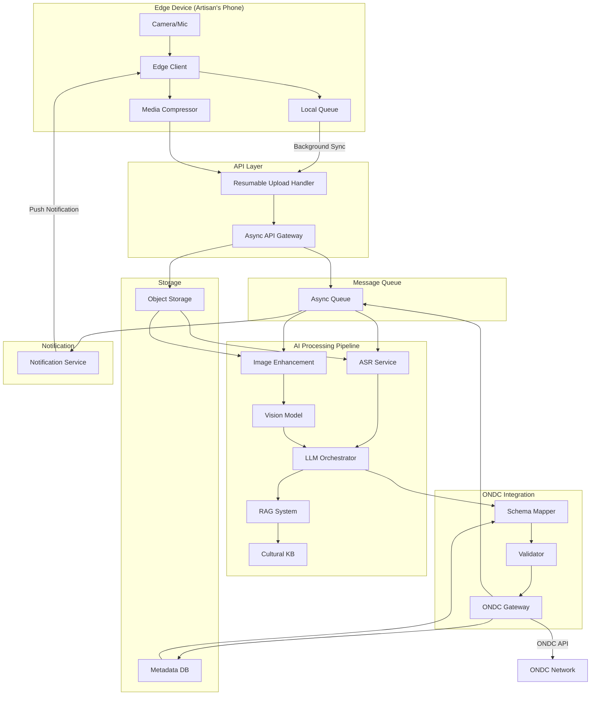

# Design Document: Vernacular Artisan Catalog

## Overview

The Vernacular Artisan Catalog system is a Zero-UI Edge-Native AI application that enables rural artisans to catalog products on ONDC through simple photo and voice capture. The system addresses "Cataloging Paralysis" by eliminating form-filling, supporting vernacular languages, and operating reliably on low-end devices with intermittent connectivity.

The architecture follows an offline-first, constraint-driven design philosophy:
- **Edge-native**: Optimized for low-RAM Android devices with intermittent connectivity
- **Zero-UI**: Single-action capture interface with no forms or dropdowns
- **Async-first**: All operations are non-blocking with persistent queuing
- **AI-powered**: Multimodal processing extracts structured data from unstructured input
- **Protocol-strict**: Deterministic mapping to ONDC/Beckn schemas with validation

## Architecture

### System Architecture Diagram



### Component Responsibilities

**Edge Client**:
- Single-button camera and voice recording interface
- On-device media compression (image: JPEG 80% quality, max 1920px; audio: Opus codec)
- Persistent local queue with SQLite storage
- Background sync with exponential backoff retry
- Status display in vernacular language

**Async API Gateway**:
- Resumable multipart upload endpoint (tus protocol)
- Immediate acknowledgment with tracking ID
- Request validation and rate limiting
- Tenant identification and routing

**Async Queue**:
- Durable message queue (RabbitMQ or AWS SQS)
- Dead letter queue for failed processing
- Priority queuing for time-sensitive operations
- Message deduplication using idempotency keys

**AI Processing Pipeline**:
- **ASR Service**: Transcribes vernacular audio using Whisper or IndicWav2Vec models
- **Image Enhancement**: Applies brightness/contrast adjustment, sharpening, background removal
- **Vision Model**: Extracts product category, color, material from images using CLIP or custom fine-tuned model
- **LLM Orchestrator**: Coordinates multimodal processing, attribute extraction, and description generation
- **RAG System**: Queries cultural knowledge base for CSI identification and context
- **Cultural KB**: Vector database with traditional craft knowledge, regional terminology, cultural significance

**ONDC Integration**:
- **Schema Mapper**: Transforms extracted attributes to Beckn protocol fields
- **Validator**: Validates against ONDC catalog schema (JSON Schema validation)
- **ONDC Gateway**: Submits catalog entries via ONDC Seller API with retry logic

**Storage**:
- **Object Storage**: S3-compatible storage for media files with lifecycle policies
- **Metadata DB**: PostgreSQL for catalog metadata, processing status, audit logs

**Notification Service**:
- Push notification delivery via Firebase Cloud Messaging
- SMS fallback for critical notifications
- Message localization to artisan's language

## Components and Interfaces

### Edge Client Interface

**Technology**: React Native or Flutter optimized for Android 8.0+

**Key Optimizations**:
- Lazy loading of non-critical components
- Image streaming to avoid loading full files in memory
- Background sync using WorkManager (Android) or background fetch (iOS)
- Minimal dependencies to reduce APK size (<15MB)

**API Contract**:
```typescript
interface CatalogEntry {
  localId: string;
  photoPath: string;
  audioPath: string;
  capturedAt: timestamp;
  syncStatus: 'queued' | 'syncing' | 'synced' | 'failed';
  retryCount: number;
}

interface UploadResponse {
  trackingId: string;
  uploadUrl: string;
  expiresAt: timestamp;
}

interface StatusUpdate {
  trackingId: string;
  stage: 'uploaded' | 'processing' | 'completed' | 'failed';
  message: string;
  catalogId?: string;
}
```

### Async API Gateway Interface

**Technology**: Python FastAPI with async/await

**Endpoints**:
```python
POST /v1/catalog/upload/initiate
  Request: { tenantId, artisanId, contentType }
  Response: { trackingId, uploadUrl, expiresAt }

POST /v1/catalog/upload/complete
  Request: { trackingId, photoKey, audioKey }
  Response: { status: 'accepted', trackingId }

GET /v1/catalog/status/{trackingId}
  Response: { stage, message, catalogId?, errorDetails? }
```

**Resumable Upload**: Implements tus protocol for chunked uploads with resume capability

### AI Pipeline Interface

**Message Contract**:
```json
{
  "trackingId": "uuid",
  "tenantId": "tenant-123",
  "artisanId": "artisan-456",
  "photoKey": "s3://bucket/path/photo.jpg",
  "audioKey": "s3://bucket/path/audio.opus",
  "language": "hi",
  "priority": "normal"
}
```

**Processing Stages**:
1. **ASR Stage**: Transcribes audio, outputs `{ transcription, language, confidence }`
2. **Vision Stage**: Analyzes image, outputs `{ category, colors, materials, confidence }`
3. **Enhancement Stage**: Improves image quality, outputs `{ enhancedImageKey, operations }`
4. **Extraction Stage**: Combines multimodal inputs, outputs `{ attributes, description, csis }`
5. **Mapping Stage**: Transforms to ONDC schema, outputs `{ ondcPayload, validationStatus }`

### ONDC Gateway Interface

**ONDC Catalog API Integration**:
```python
POST /beckn/catalog/on_search
  # ONDC catalog submission endpoint
  
Request Payload (Beckn Protocol):
{
  "context": {
    "domain": "retail",
    "country": "IND",
    "action": "on_search",
    "bap_id": "buyer-app-id",
    "bpp_id": "seller-app-id"
  },
  "message": {
    "catalog": {
      "bpp/providers": [{
        "id": "provider-id",
        "items": [{
          "id": "item-id",
          "descriptor": {
            "name": "Product Name",
            "short_desc": "Brief description",
            "long_desc": "Detailed description",
            "images": ["url1", "url2"]
          },
          "price": {
            "currency": "INR",
            "value": "500"
          },
          "category_id": "category",
          "tags": {
            "material": "cotton",
            "color": "blue"
          }
        }]
      }]
    }
  }
}
```

## Data Models

### Local Queue Entry (Edge Client)

```typescript
interface LocalQueueEntry {
  localId: string;              // UUID generated on device
  photoPath: string;            // Local file path
  audioPath: string;            // Local file path
  photoSize: number;            // Bytes
  audioSize: number;            // Bytes
  capturedAt: timestamp;
  syncStatus: QueueStatus;
  retryCount: number;
  lastRetryAt?: timestamp;
  trackingId?: string;          // Assigned after upload initiation
  errorMessage?: string;
}

enum QueueStatus {
  QUEUED = 'queued',
  SYNCING = 'syncing',
  SYNCED = 'synced',
  FAILED = 'failed'
}
```

### Catalog Processing Record (Backend)

```python
class CatalogProcessingRecord:
    tracking_id: str              # Primary key
    tenant_id: str
    artisan_id: str
    photo_key: str                # S3 object key
    audio_key: str                # S3 object key
    language: str                 # ISO 639-1 code
    
    # Processing stages
    asr_status: ProcessingStatus
    asr_result: dict              # { transcription, confidence }
    
    vision_status: ProcessingStatus
    vision_result: dict           # { category, colors, materials }
    
    extraction_status: ProcessingStatus
    extraction_result: dict       # { attributes, description, csis }
    
    mapping_status: ProcessingStatus
    ondc_payload: dict            # Final Beckn-compliant payload
    
    submission_status: ProcessingStatus
    ondc_catalog_id: str          # Assigned by ONDC
    
    created_at: timestamp
    updated_at: timestamp
    completed_at: timestamp

enum ProcessingStatus:
    PENDING = 'pending'
    IN_PROGRESS = 'in_progress'
    COMPLETED = 'completed'
    FAILED = 'failed'
    SKIPPED = 'skipped'
```

### Extracted Attributes (Intermediate Format)

```python
class ExtractedAttributes:
    # Core attributes
    category: str                 # e.g., "Handloom Saree"
    subcategory: str              # e.g., "Banarasi Silk"
    
    # Physical attributes
    material: List[str]           # e.g., ["silk", "zari"]
    colors: List[str]             # e.g., ["red", "gold"]
    dimensions: dict              # { length, width, height, unit }
    weight: dict                  # { value, unit }
    
    # Pricing
    price: dict                   # { value, currency }
    
    # Description
    short_description: str        # 1-2 sentences
    long_description: str         # Detailed transcreated description
    
    # Cultural preservation
    csis: List[CSI]               # Cultural Specific Items
    craft_technique: str          # e.g., "Handwoven on pit loom"
    region_of_origin: str         # e.g., "Varanasi, Uttar Pradesh"
    
    # Confidence scores
    confidence_scores: dict       # Per-attribute confidence

class CSI:
    vernacular_term: str          # Original term in artisan's language
    transliteration: str          # Roman script representation
    english_context: str          # Contextual explanation
    cultural_significance: str    # Why this term matters
```

### ONDC Catalog Payload

```python
class ONDCCatalogItem:
    # Beckn protocol required fields
    id: str                       # Unique item ID
    descriptor: ItemDescriptor
    price: Price
    category_id: str
    fulfillment_id: str
    location_id: str
    
    # Optional fields
    tags: dict                    # Custom attributes
    time: TimeRange               # Availability
    matched: bool
    related: bool
    recommended: bool

class ItemDescriptor:
    name: str
    code: str
    symbol: str
    short_desc: str
    long_desc: str
    images: List[str]             # Image URLs
    audio: str                    # Audio URL (optional)
    video: str                    # Video URL (optional)
```

## Data Flow and State Management

### Capture Flow (Edge Client)

1. **Capture Initiation**: Artisan opens app → Camera interface displayed
2. **Photo Capture**: Artisan takes photo → Image compressed (JPEG, 80% quality, max 1920px) → Saved to local storage
3. **Voice Recording**: Artisan records voice → Audio compressed (Opus codec, 32kbps) → Saved to local storage
4. **Queue Entry**: Create LocalQueueEntry with QUEUED status → Save to SQLite → Display preview to artisan
5. **Background Sync**: WorkManager schedules sync task → Check network connectivity → If online, proceed to upload

### Upload Flow (Edge to Backend)

1. **Upload Initiation**: Edge Client calls `/upload/initiate` → Receives trackingId and uploadUrl
2. **Chunked Upload**: Upload photo and audio in chunks using tus protocol → Update progress locally
3. **Resume on Failure**: If connection drops, resume from last successful chunk
4. **Upload Completion**: Call `/upload/complete` with trackingId → Update local status to SYNCED
5. **Retry Logic**: If upload fails after 3 attempts, mark as FAILED → Retry with exponential backoff (1min, 5min, 15min, 1hr, 6hr)

### Processing Flow (Backend)

1. **Message Enqueue**: API Gateway publishes message to Async Queue → Returns immediately
2. **ASR Processing**: Worker consumes message → Downloads audio from S3 → Transcribes using ASR model → Saves result to DB
3. **Vision Processing**: Worker downloads image → Runs enhancement → Extracts attributes using vision model → Saves result
4. **Attribute Extraction**: LLM Orchestrator combines ASR + Vision results → Queries RAG for CSI identification → Generates structured attributes
5. **Schema Mapping**: Schema Mapper transforms attributes to ONDC format → Validator checks compliance → Saves ONDC payload
6. **ONDC Submission**: ONDC Gateway submits to ONDC API → Receives catalog ID → Updates DB with completion status
7. **Notification**: Publishes status update to queue → Notification Service sends push to Edge Client

### State Transitions

```
Edge Client States:
QUEUED → SYNCING → SYNCED
SYNCING → FAILED → QUEUED (retry)
FAILED → QUEUED (manual retry)

Backend Processing States:
PENDING → IN_PROGRESS → COMPLETED
IN_PROGRESS → FAILED → PENDING (retry)
FAILED → SKIPPED (after max retries)
```

## ONDC Mapping Logic

### Attribute to Beckn Field Mapping

The Schema Mapper implements deterministic transformation rules:

```python
def map_to_beckn_item(extracted: ExtractedAttributes) -> ONDCCatalogItem:
    return ONDCCatalogItem(
        id=generate_item_id(extracted),
        descriptor=ItemDescriptor(
            name=extracted.short_description[:100],  # Truncate to 100 chars
            short_desc=extracted.short_description,
            long_desc=build_long_description(extracted),
            images=get_image_urls(extracted),
        ),
        price=Price(
            currency=extracted.price['currency'],
            value=str(extracted.price['value'])
        ),
        category_id=map_category_to_ondc(extracted.category),
        tags={
            'material': ','.join(extracted.material),
            'color': ','.join(extracted.colors),
            'craft_technique': extracted.craft_technique,
            'region': extracted.region_of_origin,
            **map_csis_to_tags(extracted.csis)
        }
    )

def build_long_description(extracted: ExtractedAttributes) -> str:
    """Builds ONDC long description preserving cultural context"""
    parts = [extracted.long_description]
    
    if extracted.csis:
        csi_section = "Cultural Significance:\n"
        for csi in extracted.csis:
            csi_section += f"- {csi.vernacular_term} ({csi.transliteration}): {csi.english_context}\n"
        parts.append(csi_section)
    
    if extracted.craft_technique:
        parts.append(f"Craft Technique: {extracted.craft_technique}")
    
    return "\n\n".join(parts)

def map_category_to_ondc(category: str) -> str:
    """Maps extracted category to ONDC standard category taxonomy"""
    category_mapping = {
        'handloom saree': 'Fashion:Ethnic Wear:Sarees',
        'pottery': 'Home & Decor:Handicrafts:Pottery',
        'jewelry': 'Fashion:Jewelry:Handcrafted',
        # ... comprehensive mapping table
    }
    return category_mapping.get(category.lower(), 'General:Handicrafts')
```

### Validation Rules

```python
def validate_ondc_payload(payload: ONDCCatalogItem) -> ValidationResult:
    errors = []
    
    # Required field validation
    if not payload.descriptor.name:
        errors.append("descriptor.name is required")
    
    if not payload.price or not payload.price.value:
        errors.append("price.value is required")
    
    if not payload.category_id:
        errors.append("category_id is required")
    
    # Format validation
    if payload.price.value and not is_valid_price(payload.price.value):
        errors.append("price.value must be numeric string")
    
    # Length validation
    if len(payload.descriptor.name) > 100:
        errors.append("descriptor.name must be <= 100 characters")
    
    if len(payload.descriptor.short_desc) > 500:
        errors.append("descriptor.short_desc must be <= 500 characters")
    
    # Image validation
    if not payload.descriptor.images:
        errors.append("At least one image is required")
    
    for img_url in payload.descriptor.images:
        if not is_valid_url(img_url):
            errors.append(f"Invalid image URL: {img_url}")
    
    return ValidationResult(
        is_valid=len(errors) == 0,
        errors=errors
    )
```

### Deterministic ID Generation

```python
def generate_item_id(extracted: ExtractedAttributes) -> str:
    """Generates deterministic item ID for idempotency"""
    # Use hash of core attributes to ensure same product gets same ID
    id_components = [
        extracted.category,
        extracted.subcategory,
        ','.join(sorted(extracted.material)),
        ','.join(sorted(extracted.colors)),
        str(extracted.price['value'])
    ]
    
    hash_input = '|'.join(id_components)
    item_hash = hashlib.sha256(hash_input.encode()).hexdigest()[:16]
    
    return f"item_{item_hash}"
```


## Correctness Properties

A property is a characteristic or behavior that should hold true across all valid executions of a system - essentially, a formal statement about what the system should do. Properties serve as the bridge between human-readable specifications and machine-verifiable correctness guarantees.

### Property Reflection

After analyzing all acceptance criteria, I identified the following redundancies and consolidations:

**Consolidations**:
- Properties 2.1 and 2.5 (queue storage and removal) can be combined into a queue lifecycle property
- Properties 3.2 and 3.3 (upload interruption and resume) are part of the same round-trip property
- Properties 7.1 and 7.2 (attribute extraction) can be combined into comprehensive extraction property
- Properties 10.1, 10.2, and 10.3 (status event publishing and notification) can be combined into event propagation property
- Properties 12.3 and 12.4 (encryption in transit and at rest) can be combined into comprehensive encryption property
- Properties 17.2, 17.3, 17.4, and 17.5 (tenant configuration) can be combined into tenant isolation property

**Redundancies Eliminated**:
- Property 8.2 (validation before submission) is subsumed by 8.5 (mandatory fields check)
- Property 9.4 (audit logging) is a cross-cutting concern covered by observability, not a unique correctness property
- Property 19.2 (independent progress tracking) is subsumed by the queue lifecycle property

### Core Properties

#### Property 1: Image Compression Preserves Quality

*For any* captured image, compressing it should reduce file size while maintaining image quality metrics (PSNR, SSIM) above acceptable thresholds (PSNR ≥ 30dB, SSIM ≥ 0.85).

**Validates: Requirements 1.2**

#### Property 2: Audio Compression Preserves Quality

*For any* recorded audio, compressing it should reduce file size while maintaining audio quality metrics (SNR) above acceptable thresholds (SNR ≥ 20dB).

**Validates: Requirements 1.4**

#### Property 3: Queue Lifecycle Consistency

*For any* catalog entry, the following lifecycle should hold:
- When captured, it appears in the local queue with QUEUED status
- When successfully synced, it is removed from the local queue
- When sync fails, it remains in queue with FAILED status and retry count incremented

**Validates: Requirements 2.1, 2.5**

#### Property 4: Offline Queue Persistence

*For any* catalog entry created while network is unavailable, it should be added to the local queue and persist across app restarts.

**Validates: Requirements 2.2**

#### Property 5: Exponential Backoff Retry

*For any* failed sync attempt, retry delays should follow exponential backoff pattern: attempt N should wait 2^(N-1) minutes (1min, 2min, 4min, 8min, 16min), and retries should stop after 5 attempts.

**Validates: Requirements 2.4**

#### Property 6: Resumable Upload Round-Trip

*For any* upload interrupted at any chunk position, resuming the upload should complete successfully with the final uploaded file being identical to the original file.

**Validates: Requirements 3.2, 3.3**

#### Property 7: Upload Acknowledgment Immediacy

*For any* completed upload, the API should return acknowledgment within 2 seconds, regardless of AI processing duration.

**Validates: Requirements 3.4, 3.5**

#### Property 8: ASR Transcription Completeness

*For any* audio file, the ASR pipeline should produce a transcription output (may be empty if audio is silent, but should not fail).

**Validates: Requirements 4.1**

#### Property 9: Language Preservation

*For any* transcription, the output language should match the input audio language (no forced translation to English).

**Validates: Requirements 4.3**

#### Property 10: Low Confidence Flagging

*For any* transcription segment with confidence score below 0.7, it should be flagged for manual review rather than included in the final transcription.

**Validates: Requirements 4.4**

#### Property 11: RAG System Invocation

*For any* vernacular description processed, the RAG system should be queried for CSI identification.

**Validates: Requirements 5.1**

#### Property 12: CSI Term Preservation

*For any* identified CSI, the original vernacular term should appear in the final output (either in the description or in metadata).

**Validates: Requirements 5.2, 5.5**

#### Property 13: Product Extraction Completeness

*For any* image processed, the vision pipeline should produce product extraction output (bounding box, cropped image, or error if no product detected).

**Validates: Requirements 6.1**

#### Property 14: Image Enhancement Improves Metrics

*For any* low-brightness image (mean brightness < 100), enhancement should increase brightness metrics while maintaining contrast.

**Validates: Requirements 6.2**

#### Property 15: Multi-Resolution Image Generation

*For any* processed image, the system should generate at least 3 image sizes: thumbnail (≤200px), medium (≤800px), and full (≤1920px).

**Validates: Requirements 6.4**

#### Property 16: Poor Quality Notification

*For any* image with quality score below threshold (blur metric > 100 or brightness < 20), a notification should be sent to the artisan.

**Validates: Requirements 6.5**

#### Property 17: Comprehensive Attribute Extraction

*For any* catalog entry, the extraction pipeline should attempt to extract all specified attributes: category, material, color, dimensions, weight, craft technique, and generate confidence scores for each.

**Validates: Requirements 7.1, 7.2, 7.5**

#### Property 18: Price Extraction and Normalization

*For any* transcription containing price information (numeric value with currency indicator), the price should be extracted and normalized to standard format {value: number, currency: string}.

**Validates: Requirements 7.3**

#### Property 19: Voice Priority Resolution

*For any* attribute where both image and voice provide conflicting values, the voice-derived value should appear in the final output.

**Validates: Requirements 7.4**

#### Property 20: Beckn Schema Mapping Completeness

*For any* extracted attributes, the schema mapper should produce a valid Beckn protocol payload with all extracted attributes mapped to appropriate fields.

**Validates: Requirements 8.1**

#### Property 21: Validation Failure Handling

*For any* payload that fails schema validation, the system should log specific violations and either auto-correct or flag for manual review (not silently fail).

**Validates: Requirements 8.3, 8.4**

#### Property 22: Mandatory Field Enforcement

*For any* ONDC submission, all mandatory fields (descriptor.name, price.value, category_id, images) must be populated, or submission should be rejected.

**Validates: Requirements 8.5**

#### Property 23: Idempotency Key Uniqueness

*For any* catalog entry, the generated idempotency key should be unique and deterministic (same input attributes produce same key).

**Validates: Requirements 9.1**

#### Property 24: Retry Idempotency Preservation

*For any* failed ONDC submission that is retried, all retry attempts should use the same idempotency key as the original attempt.

**Validates: Requirements 9.2**

#### Property 25: Error Categorization

*For any* ONDC error response, the system should categorize it as either 'retryable' (network errors, 5xx) or 'permanent' (validation errors, 4xx).

**Validates: Requirements 9.3**

#### Property 26: Catalog ID Persistence

*For any* successful ONDC submission, the returned catalog ID should be stored in the database and associated with the tracking ID.

**Validates: Requirements 9.5**

#### Property 27: Status Event Propagation

*For any* processing stage completion (AI processing, ONDC submission), a status event should be published to the queue, consumed by notification service, and result in a push notification to the Edge Client.

**Validates: Requirements 10.1, 10.2, 10.3**

#### Property 28: Notification Localization

*For any* notification sent to an artisan, the message should be in the artisan's configured vernacular language.

**Validates: Requirements 10.4, 10.5**

#### Property 29: Data Minimization

*For any* data transmission from Edge Client, it should not contain location data, device identifiers, or personal information beyond artisan ID and catalog media.

**Validates: Requirements 12.1**

#### Property 30: Comprehensive Encryption

*For any* media file, it should be encrypted in transit (TLS 1.3) and at rest (AES-256).

**Validates: Requirements 12.3, 12.4**

#### Property 31: Media Retention Policy

*For any* published catalog entry, the original media files should be deleted after 30 days unless the artisan has opted for retention.

**Validates: Requirements 12.5**

#### Property 32: Image Resize Before Inference

*For any* image processed by vision models, it should be resized to minimum required dimensions before model inference.

**Validates: Requirements 13.2**

#### Property 33: Batch Processing Optimization

*For any* set of 5 or more queued entries available simultaneously, the system should process them in a batch rather than individually.

**Validates: Requirements 13.3**

#### Property 34: Cost Threshold Alerting

*For any* catalog entry with processing cost exceeding defined threshold ($0.50), an alert should be generated.

**Validates: Requirements 13.5**

#### Property 35: Graceful Degradation

*For any* single component failure (ASR, image enhancement, RAG), the overall processing should continue with degraded functionality rather than failing completely.

**Validates: Requirements 14.4, 14.5**

#### Property 36: Metrics Emission

*For any* system operation (upload, processing, submission), relevant metrics (latency, status, error) should be emitted to the monitoring system.

**Validates: Requirements 15.1**

#### Property 37: Distributed Trace Propagation

*For any* request flowing through multiple components, trace context should be propagated across all components for end-to-end tracking.

**Validates: Requirements 15.4**

#### Property 38: Stateless Worker Scalability

*For any* processing worker added or removed, no in-flight data should be lost (all state is in queue or database).

**Validates: Requirements 16.3, 16.4**

#### Property 39: Tenant Data Isolation

*For any* two different tenants, one tenant should not be able to access or modify another tenant's data (catalog entries, media, configuration).

**Validates: Requirements 17.1**

#### Property 40: Tenant Configuration Scoping

*For any* artisan associated with a tenant, all operations should use that tenant's specific configuration (language preferences, cultural KB, ONDC credentials, quotas).

**Validates: Requirements 17.2, 17.3, 17.4, 17.5**

#### Property 41: Update Detection

*For any* catalog entry submitted with attributes matching an existing entry (same category, material, color, price), it should be detected as an update and use the ONDC update API.

**Validates: Requirements 18.1, 18.2**

#### Property 42: Version History Preservation

*For any* catalog entry update, the previous version should be retained in version history with timestamp.

**Validates: Requirements 18.3**

#### Property 43: Catalog ID Preservation on Update

*For any* catalog entry update, the ONDC catalog ID should remain unchanged from the original entry.

**Validates: Requirements 18.4**

#### Property 44: Update Notification

*For any* successful catalog update published to ONDC, a notification should be sent to the artisan.

**Validates: Requirements 18.5**

#### Property 45: Parallel Processing

*For any* set of queued entries, when system resources are available (queue workers < max capacity), entries should be processed in parallel.

**Validates: Requirements 19.3**

#### Property 46: Batch Completion Notification

*For any* batch of catalog entries where all entries reach terminal state (completed or failed), a summary notification should be sent to the artisan.

**Validates: Requirements 19.5**

#### Property 47: Preview Generation

*For any* catalog entry queued locally, a preview should be generated using the captured media within 1 second.

**Validates: Requirements 20.1**

#### Property 48: Preview Update on Processing

*For any* catalog entry where AI processing completes, the local preview should be updated with extracted attributes within 5 seconds of receiving the status event.

**Validates: Requirements 20.4**

#### Property 49: Preview Localization

*For any* preview displayed, all text should be in the artisan's configured vernacular language.

**Validates: Requirements 20.5**

## Error Handling

### Error Categories

**Transient Errors** (Retryable):
- Network connectivity failures
- Service timeouts
- Rate limiting (429)
- Server errors (5xx)
- Queue full conditions

**Permanent Errors** (Not Retryable):
- Invalid media format
- Schema validation failures
- Authentication failures (401)
- Authorization failures (403)
- Resource not found (404)
- Malformed requests (400)

### Error Handling Strategies

**Edge Client Errors**:
```typescript
class ErrorHandler {
  handleCaptureError(error: CaptureError): void {
    if (error.type === 'CAMERA_PERMISSION_DENIED') {
      showLocalizedMessage('camera_permission_required');
      openAppSettings();
    } else if (error.type === 'STORAGE_FULL') {
      showLocalizedMessage('storage_full');
      suggestCleanup();
    } else {
      logError(error);
      showLocalizedMessage('capture_failed_retry');
    }
  }
  
  handleSyncError(entry: LocalQueueEntry, error: SyncError): void {
    if (isTransientError(error)) {
      entry.retryCount++;
      entry.syncStatus = 'queued';
      scheduleRetry(entry, calculateBackoff(entry.retryCount));
    } else {
      entry.syncStatus = 'failed';
      entry.errorMessage = localizeError(error);
      notifyUser(entry);
    }
  }
}
```

**Backend Processing Errors**:
```python
class ProcessingErrorHandler:
    def handle_asr_error(self, record: CatalogProcessingRecord, error: Exception):
        if isinstance(error, ModelTimeoutError):
            # Retry with smaller audio chunk
            record.asr_status = ProcessingStatus.PENDING
            self.queue.publish(record, priority='high')
        elif isinstance(error, UnsupportedLanguageError):
            # Flag for manual transcription
            record.asr_status = ProcessingStatus.FAILED
            record.asr_result = {'error': 'unsupported_language', 'fallback': 'manual'}
            self.notify_manual_review(record)
        else:
            # Log and continue with empty transcription
            logger.error(f"ASR failed for {record.tracking_id}: {error}")
            record.asr_status = ProcessingStatus.SKIPPED
            record.asr_result = {'transcription': '', 'confidence': 0.0}
    
    def handle_validation_error(self, record: CatalogProcessingRecord, errors: List[str]):
        # Attempt automatic correction
        corrected_payload = self.auto_correct(record.ondc_payload, errors)
        
        if corrected_payload:
            record.ondc_payload = corrected_payload
            record.mapping_status = ProcessingStatus.COMPLETED
        else:
            # Flag for manual review
            record.mapping_status = ProcessingStatus.FAILED
            self.notify_manual_review(record, errors)
```

**ONDC Submission Errors**:
```python
class ONDCErrorHandler:
    def handle_submission_error(self, record: CatalogProcessingRecord, response: ONDCResponse):
        error_category = self.categorize_error(response)
        
        if error_category == 'RETRYABLE':
            # Retry with same idempotency key
            record.submission_status = ProcessingStatus.PENDING
            self.queue.publish_with_delay(record, delay_seconds=60)
        elif error_category == 'VALIDATION_ERROR':
            # Parse specific validation errors and attempt correction
            validation_errors = self.parse_validation_errors(response)
            self.handle_validation_error(record, validation_errors)
        else:
            # Permanent failure - notify and log
            record.submission_status = ProcessingStatus.FAILED
            self.audit_log.log_failure(record, response)
            self.notify_artisan(record, 'submission_failed')
    
    def categorize_error(self, response: ONDCResponse) -> str:
        if response.status_code >= 500:
            return 'RETRYABLE'
        elif response.status_code == 429:
            return 'RETRYABLE'
        elif response.status_code == 400 and 'validation' in response.body:
            return 'VALIDATION_ERROR'
        else:
            return 'PERMANENT'
```

### Circuit Breaker Pattern

For external service dependencies (ASR, Vision models, ONDC API):

```python
class CircuitBreaker:
    def __init__(self, failure_threshold: int = 5, timeout: int = 60):
        self.failure_count = 0
        self.failure_threshold = failure_threshold
        self.timeout = timeout
        self.state = 'CLOSED'  # CLOSED, OPEN, HALF_OPEN
        self.last_failure_time = None
    
    def call(self, func, *args, **kwargs):
        if self.state == 'OPEN':
            if time.time() - self.last_failure_time > self.timeout:
                self.state = 'HALF_OPEN'
            else:
                raise CircuitBreakerOpenError()
        
        try:
            result = func(*args, **kwargs)
            if self.state == 'HALF_OPEN':
                self.state = 'CLOSED'
                self.failure_count = 0
            return result
        except Exception as e:
            self.failure_count += 1
            self.last_failure_time = time.time()
            
            if self.failure_count >= self.failure_threshold:
                self.state = 'OPEN'
            
            raise e
```

## Testing Strategy

### Dual Testing Approach

The system requires both unit testing and property-based testing for comprehensive coverage:

**Unit Tests**: Focus on specific examples, edge cases, and integration points
- Specific language transcription examples (Hindi "साड़ी" → "saree")
- Edge cases (empty audio, corrupted images, malformed ONDC responses)
- Error conditions (network failures, validation errors)
- Integration between components (API → Queue → Worker)

**Property Tests**: Verify universal properties across all inputs
- Compression quality preservation across random images
- Queue lifecycle consistency across random operations
- Encryption enforcement across all data transmissions
- Tenant isolation across random tenant pairs

### Property-Based Testing Configuration

**Framework Selection**:
- **Python Backend**: Use Hypothesis for property-based testing
- **TypeScript/JavaScript Edge Client**: Use fast-check for property-based testing

**Test Configuration**:
- Minimum 100 iterations per property test (due to randomization)
- Each property test must reference its design document property
- Tag format: `# Feature: vernacular-artisan-catalog, Property {number}: {property_text}`

**Example Property Test**:
```python
from hypothesis import given, strategies as st
import hypothesis

@given(
    image=st.binary(min_size=1024, max_size=10*1024*1024),
    format=st.sampled_from(['JPEG', 'PNG', 'WEBP'])
)
@hypothesis.settings(max_examples=100)
def test_image_compression_preserves_quality(image, format):
    """
    Feature: vernacular-artisan-catalog
    Property 1: Image Compression Preserves Quality
    
    For any captured image, compressing it should reduce file size 
    while maintaining quality metrics above thresholds.
    """
    # Arrange
    original_size = len(image)
    original_quality = calculate_quality_metrics(image)
    
    # Act
    compressed = compress_image(image, format, quality=80)
    compressed_size = len(compressed)
    compressed_quality = calculate_quality_metrics(compressed)
    
    # Assert
    assert compressed_size < original_size, "Compression should reduce file size"
    assert compressed_quality['psnr'] >= 30, "PSNR should be >= 30dB"
    assert compressed_quality['ssim'] >= 0.85, "SSIM should be >= 0.85"
```

### Test Coverage Requirements

**Unit Test Coverage**:
- API endpoints: 100% coverage
- Error handlers: 100% coverage
- Schema mappers: 100% coverage
- Core business logic: ≥90% coverage

**Property Test Coverage**:
- All 49 correctness properties must have corresponding property tests
- Each property test must run minimum 100 iterations
- Property tests should use realistic data generators (not just random bytes)

### Integration Testing

**End-to-End Flow Tests**:
1. Capture → Queue → Upload → Process → Submit → Notify
2. Offline capture → Online sync → Process → Submit
3. Failed processing → Retry → Success
4. Failed ONDC submission → Retry → Success
5. Update existing catalog entry → Version history

**Component Integration Tests**:
- Edge Client ↔ API Gateway (upload resumption)
- API Gateway ↔ Queue (message publishing)
- Queue ↔ Workers (message consumption)
- Workers ↔ Storage (media retrieval)
- Workers ↔ ONDC Gateway (submission)
- ONDC Gateway ↔ Notification Service (status updates)

### Performance Testing

**Load Testing Scenarios**:
- 1000 concurrent uploads
- 10,000 queued entries processing
- 100 requests/second to API Gateway
- Burst traffic (0 → 500 requests in 1 minute)

**Performance Benchmarks**:
- API response time: p95 < 200ms, p99 < 500ms
- Upload completion: p95 < 30s for 5MB media
- ASR processing: p95 < 30s for 2min audio
- Vision processing: p95 < 10s per image
- End-to-end: p95 < 120s from upload to ONDC submission

### Security Testing

**Security Test Cases**:
- Tenant isolation: Verify tenant A cannot access tenant B's data
- Encryption verification: Verify TLS 1.3 in transit, AES-256 at rest
- Authentication: Verify unauthorized requests are rejected
- Input validation: Verify malformed inputs are rejected
- Injection attacks: Verify SQL injection, command injection prevention
- Rate limiting: Verify rate limits are enforced

### Monitoring and Observability Testing

**Observability Verification**:
- Verify metrics are emitted for all operations
- Verify distributed traces span all components
- Verify alerts trigger at defined thresholds
- Verify logs contain required context (tracking_id, tenant_id, stage)
 